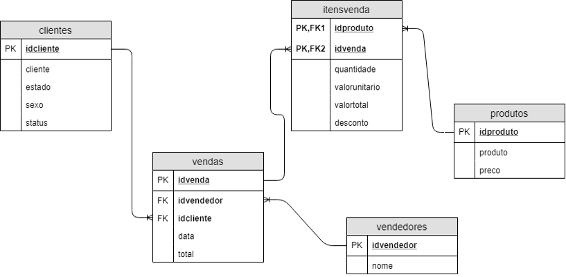
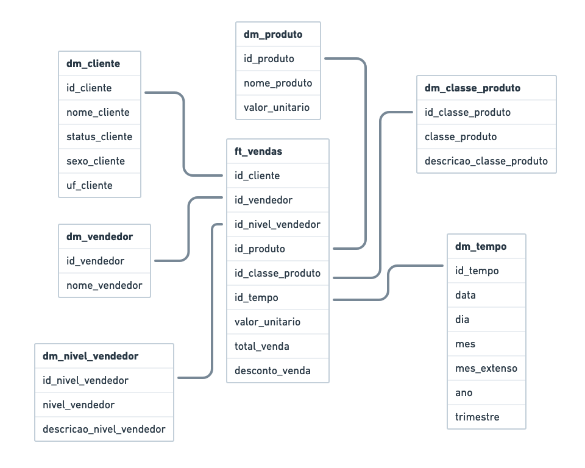

# Rotina ETL - Controle de Vendas

Rotina ETL para uma base de dados de controle de vendas. Avaliação da matéria Laboratório de Banco de Dados.
 
## Instruções

O objetivo da atividade é extrair os dados do banco operacional (extract), transformar as informações (transform) e carregar no banco de dados dimensional (load).

Esquema do Banco Operacional:


Esquema do Banco Dimensional:


## Como executar

### Banco de Dados
Primeiro, é necessário realizar a inicialização dos bancos de dados. 
Para tal, é necessário possuir em sua máquina o [Docker](https://docs.docker.com/get-docker/) e o [Docker Compose](https://docs.docker.com/compose/install/).  
No diretório do projeto, execute o comando:
```
docker-compose up -d
```
Dois bancos de dados do tipo `PostgreSQL` serão inicializado com as seguintes configurações:
```
host: localhost
porta: 5433
usuário: postgres
senha: 123456
db: operational_db
```
que possui o banco operacional, no schema `relacional`.  
```
host: localhost
porta: 5434
usuário: postgres
senha: 123456
db: dimensional_db
```
que guarda o banco dimensional, no schema `dimensional`.

### Rotina ETL
Para rodar a rotina ETL, é necessário que o [Python](https://www.python.org/downloads/) esteja instalado na máquina e precisamos instalar as bibliotecas requeridas.
Na pasta do ETL, executa-se o comando:
```
pip install -r requirements.txt
```
Ou, caso prefira usar o `Poetry`
```
poetry install
```
Por fim, executa-se o arquivo do script:
```
python script.py
```

## Notebook - [](https://colab.research.google.com/github/nataliafonseca/etl_controle_de_vendas/blob/main/notebook.ipynb)  

Para uma melhor visualização do passo a passo do script, há o arquivo `notebook.ipynb`

## Autoras
- Natália Braga da Fonseca ([@nataliafonseca](https://github.com/nataliafonseca))
- Natalie Pereira Macedo ([@NathyM](https://github.com/NathyM)).